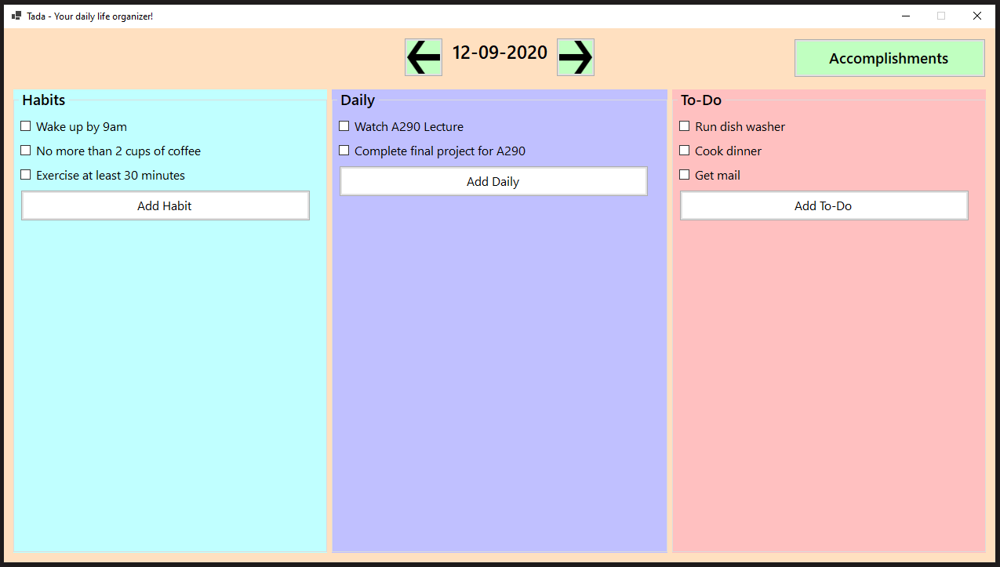
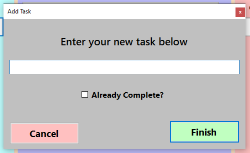
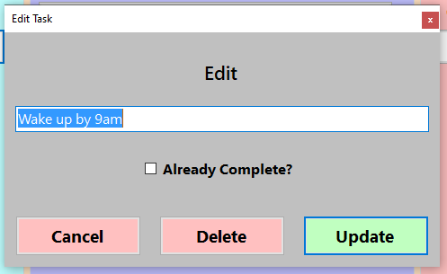
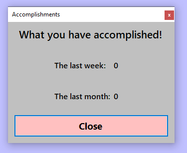

# Tada
Tada daily life organizer final project from CSCI-A 290 Windows Programming with C# and .NET course at Indiana University Fall 2020

### Tada Application

### Adding a Task

### Editing/Removing a Task

### Accomplishments Window

### From Course README
File Structure:

- Directories are automatically created if not there on boot.
- There is a main "data" folder in the project root, and that is where all of the data is created/manipulated/saved.
- To reset all of the data just delete the "data" folder in the project root. If there is an error (which there shouldn't be) it should fix anything I missed.
- There is no need to mess with any of the data files or folders, doing so will likely just break the program.

Main Window:

- Everything is clearly labeled and also shown in the User Guide. So there is not much instruction needed.
- When the tasks/buttons reach the bottom of each column scroll bars automatically appear.
- Closing the application with the "X" is really the only way and I have just Event Handled that with a save operation.
- If for some reason you add a lot of data to the program it can take a second loading between days because it is read/writing to text files every time.
- It can be minimized, but not maximized or anything changing size.
- Left clicking a task will populate the check box and mark it complete.
- Right clicking a task will bring up the "Edit Task" window for those operations.

Add Task:

- Each column has it's own "Add" button and the new task does go into the corresponding column.
- There is an option to mark the task as already complete and the check will carry to the column when "Finish" is clicked.
- The "Cancel" button just closes the "Add Task" window and nothing happens after that.
- It can be minimized, but not maximized or anything changing size.

Edit Task:

- Looks very similar to the "Add Task" window but with different labels and an extra button.
- The check box and text field will have the same information as from the column, but can both be changed in the window.
- The "Cancel" button just closes the "Edit Task" window and nothing happens after that.
- The "Delete" button will remove the task and it's data from the program.
- The "Update" button will update the said task with the new data.

Accomplishments Window:

- This window is quite simple with a "Close" button to close the window.
- It just shows the stats of the last 7 days and the last 30 days.
- It does calculate from the files when you click the button, so it can take a bit for it to load.
- It as of now takes >=((30 + 7) * 3) operations to calculate the accomplishments and that is without reading downwards through many tasks.
- In my original plans I had the yearly statistics, but after implementing that it crashed the program. It would have taken >=((365 + 30 + 7) * 3) and with a lot of data much more.
- Everything is done in O(n) time and n can be pretty big so that is where the long load times can come from.
